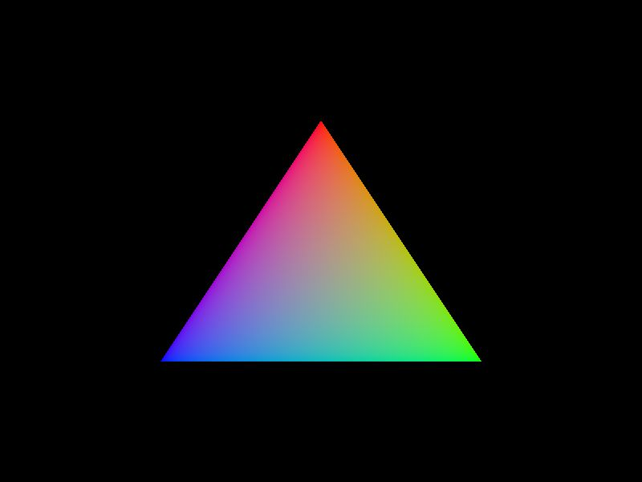
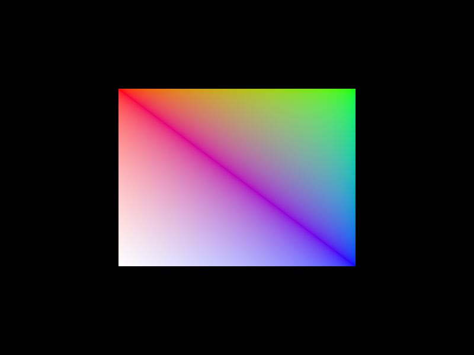

# Learning Vulkan via Rust + Ash

Learning Vulkan via Ash sample code and [vulkan-tutorial](https://vulkan-tutorial.com/Introduction)




https://user-images.githubusercontent.com/33274231/192131063-4ce5db7a-f49b-43bd-b57f-5540e941e0a0.mp4

https://user-images.githubusercontent.com/33274231/192804409-828aca43-3e0d-46a9-bafa-93ae0072bad2.mp4

https://user-images.githubusercontent.com/33274231/192804498-993f2900-d466-4883-9df1-a3716010387f.mp4

https://user-images.githubusercontent.com/33274231/193071546-081a95d3-40de-44b4-ac75-062b79c5ce35.mp4

https://user-images.githubusercontent.com/33274231/193556199-9340d96d-627a-4a3d-9749-c7fd64008ee8.mp4

## So, what is this all about?

This is a direct implementation of the [Vulkan Tutorial](https://vulkan-tutorial.com) using [Ash](https://docs.rs/ash). \
The source code is mostly based off of [unknownue's vulkan-tutorial-rust](https://github.com/unknownue/vulkan-tutorial-rust) \
while filling in the gaps where it had problems with [Ash's example code](https://github.com/ash-rs/ash/blob/master/examples/src/lib.rs). \
While unknownue's tutorial is using raw structs to initialize create infos, \
this is using builders to mitigate any unnessesary initialization.

## Chapters
- [chapter 0](https://github.com/bonohub13/learning_vulkan/tree/chapter_0)
    - [Base Code](https://vulkan-tutorial.com/Drawing_a_triangle/Setup/Base_code)
- [chapter 1](https://github.com/bonohub13/learning_vulkan/tree/chapter_1)
    - [Instance](https://vulkan-tutorial.com/Drawing_a_triangle/Setup/Instance)
- [chapter 2](https://github.com/bonohub13/learning_vulkan/tree/chapter_2)
    - [Validation Layers](https://vulkan-tutorial.com/Drawing_a_triangle/Setup/Validation_layers)
- [chapter 3](https://github.com/bonohub13/learning_vulkan/tree/chapter_3)
    - [Physical devices and queue families](https://vulkan-tutorial.com/Drawing_a_triangle/Setup/Physical_devices_and_queue_families)
- [chapter 4](https://github.com/bonohub13/learning_vulkan/tree/chapter_4)
    - [Logical device and queues](https://vulkan-tutorial.com/Drawing_a_triangle/Setup/Logical_device_and_queues)
- [chapter 5](https://github.com/bonohub13/learning_vulkan/tree/chapter_5)
    - [Logical device and queues](https://vulkan-tutorial.com/Drawing_a_triangle/Presentation/Window_surface)
- [chapter 6](https://github.com/bonohub13/learning_vulkan/tree/chapter_6)
    - [Swap chain](https://vulkan-tutorial.com/Drawing_a_triangle/Presentation/Swap_chain)
- [chapter 7](https://github.com/bonohub13/learning_vulkan/tree/chapter_7)
    - [Image views](https://vulkan-tutorial.com/Drawing_a_triangle/Presentation/Image_views)
- [chapter 8](https://github.com/bonohub13/learning_vulkan/tree/chapter_8)
    - [Introduction](https://vulkan-tutorial.com/Drawing_a_triangle/Graphics_pipeline_basics/Introduction)
- [chapter 9](https://github.com/bonohub13/learning_vulkan/tree/chapter_9)
    - [Shader modules](https://vulkan-tutorial.com/Drawing_a_triangle/Graphics_pipeline_basics/Shader_modules)
- [chapter 10](https://github.com/bonohub13/learning_vulkan/tree/chapter_10)
    - [Fixed functions](https://vulkan-tutorial.com/Drawing_a_triangle/Graphics_pipeline_basics/Fixed_functions)
- [chapter 11](https://github.com/bonohub13/learning_vulkan/tree/chapter_11)
    - [Render passes](https://vulkan-tutorial.com/Drawing_a_triangle/Graphics_pipeline_basics/Render_passes)
- [chapter 12](https://github.com/bonohub13/learning_vulkan/tree/chapter_12)
    - [Conclusion](https://vulkan-tutorial.com/Drawing_a_triangle/Graphics_pipeline_basics/Conclusion)
- [chapter 13](https://github.com/bonohub13/learning_vulkan/tree/chapter_13)
    - [Framebuffers](https://vulkan-tutorial.com/Drawing_a_triangle/Drawing/Framebuffers)
- [chapter 14](https://github.com/bonohub13/learning_vulkan/tree/chapter_14)
    - [Command buffers](https://vulkan-tutorial.com/Drawing_a_triangle/Drawing/Command_buffers)
- [chapter 15](https://github.com/bonohub13/learning_vulkan/tree/chapter_15)
    - [Rendering and presentation](https://vulkan-tutorial.com/Drawing_a_triangle/Drawing/Rendering_and_presentation)
- [chapter 16](https://github.com/bonohub13/learning_vulkan/tree/chapter_16)
    - [Swap chain recreation](https://vulkan-tutorial.com/Drawing_a_triangle/Swap_chain_recreation)
- [chapter 17](https://github.com/bonohub13/learning_vulkan/tree/chapter_17)
    - [Vertex input description](https://vulkan-tutorial.com/Vertex_buffers/Vertex_input_description)
- [chapter 18](https://github.com/bonohub13/learning_vulkan/tree/chapter_18)
    - [Vertex buffer creation](https://vulkan-tutorial.com/Vertex_buffers/Vertex_buffer_creation)
- [chapter 19](https://github.com/bonohub13/learning_vulkan/tree/chapter_19)
    - [Staging buffer](https://vulkan-tutorial.com/Vertex_buffers/Staging_buffer)
- [chapter 20](https://github.com/bonohub13/learning_vulkan/tree/chapter_20)
    - [Index buffer](https://vulkan-tutorial.com/Vertex_buffers/Index_buffer)
- [chapter 21](https://github.com/bonohub13/learning_vulkan/tree/chapter_21) __DO NOT RUN!__
    - [Descriptor layout and buffer](https://vulkan-tutorial.com/Uniform_buffers/Descriptor_layout_and_buffer)
- [chapter 22](https://github.com/bonohub13/learning_vulkan/tree/chapter_22)
    - [Descriptor pool and sets](https://vulkan-tutorial.com/Uniform_buffers/Descriptor_pool_and_sets)
- [chapter 23](https://github.com/bonohub13/learning_vulkan/tree/chapter_23)
    - [Images](https://vulkan-tutorial.com/Texture_mapping/Images)
- [chapter 24](https://github.com/bonohub13/learning_vulkan/tree/chapter_24)
    - [Image view and sampler](https://vulkan-tutorial.com/Texture_mapping/Image_view_and_sampler)
- [chapter 25](https://github.com/bonohub13/learning_vulkan/tree/chapter_25)
    - [Combined image sampler](https://vulkan-tutorial.com/Texture_mapping/Combined_image_sampler)
- [chapter 26](https://github.com/bonohub13/learning_vulkan/tree/chapter_26)
    - [Depth buffering](https://vulkan-tutorial.com/Depth_buffering)
- [chapter 27](https://github.com/bonohub13/learning_vulkan/tree/chapter_27)
    - [Loading models](https://vulkan-tutorial.com/Loading_models)
- [chapter 28](https://github.com/bonohub13/learning_vulkan/tree/chapter_28)
    - [Generating Mipmaps](https://vulkan-tutorial.com/Generating_Mipmaps)
- [chapter 29](https://github.com/bonohub13/learning_vulkan/tree/chapter_29)
    - [Multisampling](https://vulkan-tutorial.com/Multisampling)

## Fatal commits
- September 13, 2022 [FIXED: September 18, 2022]
    - ~~Reverted ash (main branch) to Chapter 11 due fatal bug in code.~~ \
    ~~(It's REALLY bad. Straight up core dumps)~~
    - ~~If you want check the source code if individual chapters later than~~ \
    ~~chapter 11, the branches are still up.~~ \
    ~~(If the bug is patched up, it will be applied to later chapters.)~~

## Building process
- Method 1: Building with native packages
    1. build shader code
        ``` bash
        make build-shader
        ```
    2. build source code
        ``` bash
        make build
        ```
- Method 2: Building with Docker Containers (Recommended)
    1. build shader code
        ``` bash
        make build-shader
        ```
    2. build the docker image
        ``` bash
        make rebuild-linux-image
        ```
    3. build source code
        ``` bash
        make docker-build
        ```

### Warning when building with Docker Containers
When building the codes with docker, it is highly recommended to use [docker-rootless](https://docs.docker.com/engine/security/rootless/). \
If you build using standard docker (not rootless docker), the built binary might end up
with root user ownership. (which sucks BTW when you want to build, run, remove the file)

